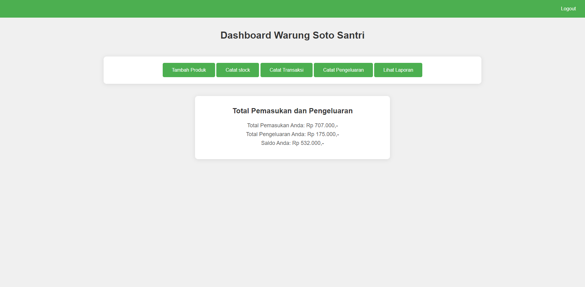
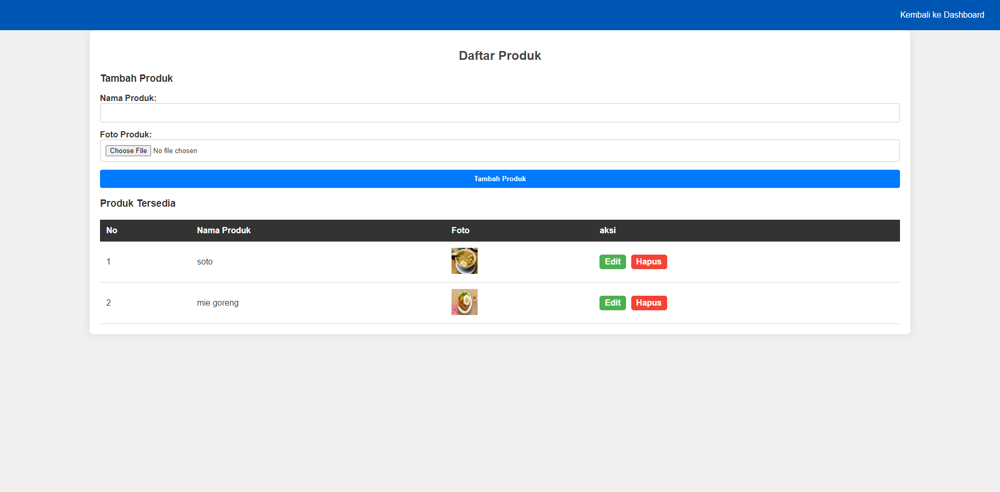
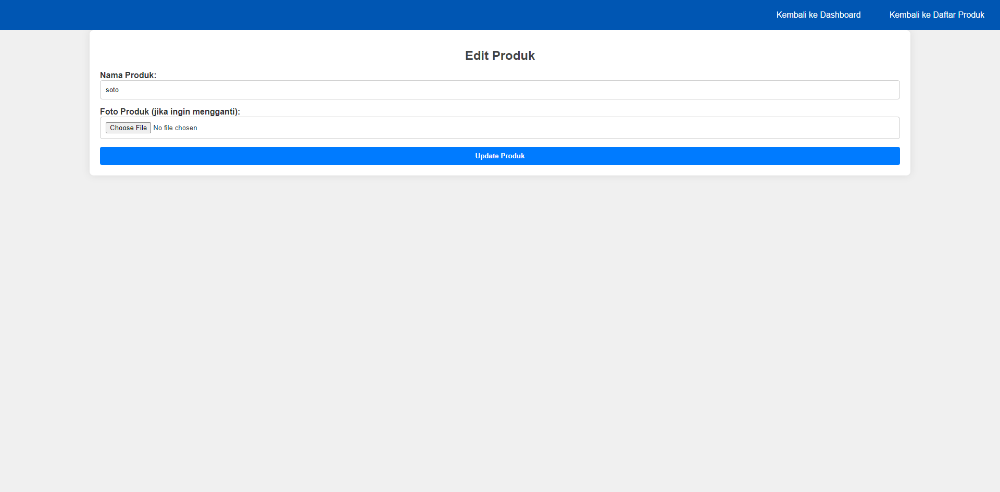
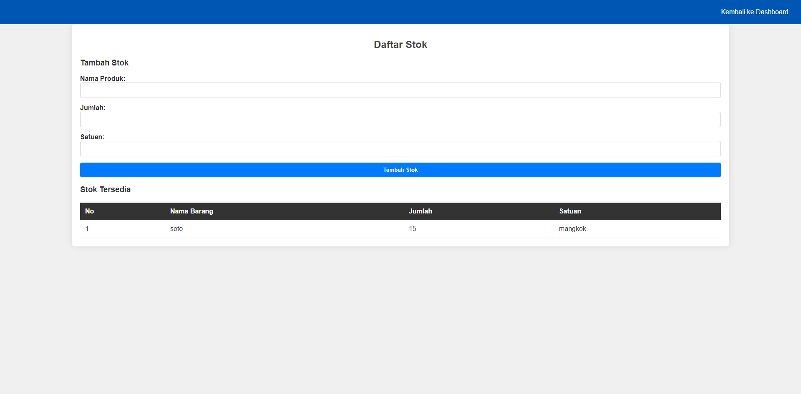
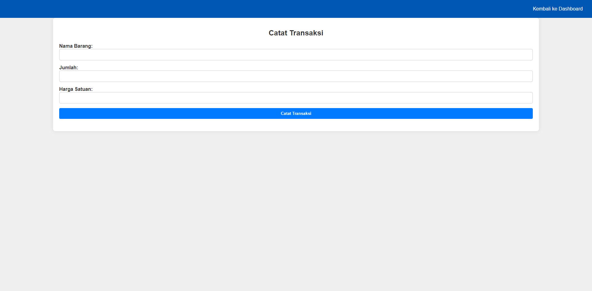
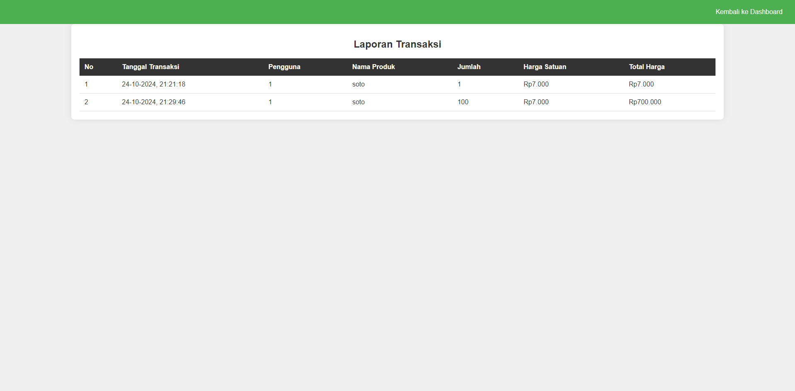
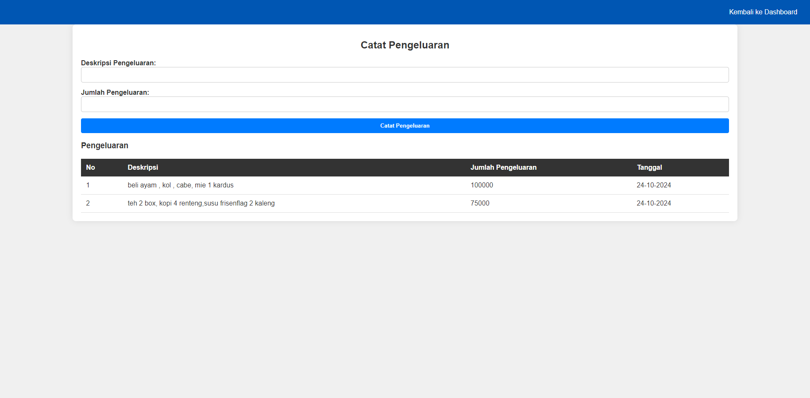
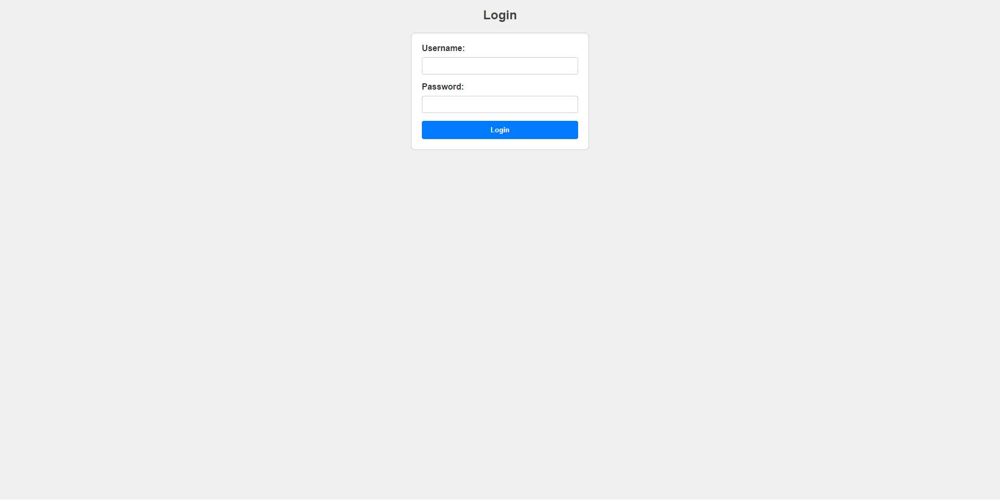

# Warung Soto Santri

Aplikasi **Warung Soto Santri** adalah sistem manajemen sederhana untuk mengelola transaksi, stok produk, serta mencatat pemasukan dan pengeluaran pada warung makan. Aplikasi ini dibangun menggunakan **PHP, MySQL, dan CSS**, serta memiliki fitur yang mudah diakses oleh admin dan pengguna.

## Fitur Utama
Aplikasi ini menyediakan beberapa fitur utama yang meliputi:
1. **Dashboard Utama**: Terdapat navigasi untuk berbagai fitur utama seperti penambahan produk, pencatatan stok, transaksi, pencatatan pengeluaran, dan laporan total pemasukan serta pengeluaran.
2. **Manajemen Produk**: Melalui halaman ini, admin dapat menambahkan produk baru, mengubah data produk yang sudah ada, serta menghapus produk yang tidak relevan.
3. **Pencatatan Transaksi**: Memungkinkan admin untuk mencatat setiap transaksi penjualan yang terjadi di warung.
4. **Pencatatan Pengeluaran**: Admin dapat mencatat setiap pengeluaran operasional yang dilakukan oleh warung.
5. **Laporan Transaksi**: Menyediakan informasi terperinci mengenai transaksi yang telah tercatat, termasuk jumlah produk, harga satuan, total harga, dan tanggal transaksi.
6. **Total Pemasukan dan Pengeluaran**: Terdapat ringkasan mengenai total pemasukan, total pengeluaran, dan saldo warung.

## Teknologi yang Digunakan
- **Backend**: PHP dengan koneksi MySQLi
- **Database**: MySQL
- **Frontend**: HTML dan CSS

## Pengguna
Aplikasi ini memiliki pengguna utama:
1. **Pengguna**: Diberikan hak akses untuk mengelola produk, mencatat transaksi, mencatat pengeluaran, dan melihat laporan transaksi serta laporan total pemasukan dan pengeluaran.

## Instalasi
1. **Clone atau download** repository ini ke direktori server lokal Anda.
2. **Buat database MySQL** dengan struktur yang sesuai (lihat file `database.sql` atau sesuaikan dengan skema yang telah diberikan).
3. **Import database** ke MySQL server menggunakan perintah berikut:
   ```sql
   mysql -u username -p db_soto_santri < database.sql


 ## Tampilan Halaman
1. **Dashboard Utama**: 
   

2. **Halaman Produk**:
   

3. **Edit Produk**:
   

4. **Halaman Stock**:
   

5. **catat Transaksi**:
   

6. **Laporan Transaksi**:
   

7. **catat pengeluaran**:
   

8. **Halaman Login**:
   
